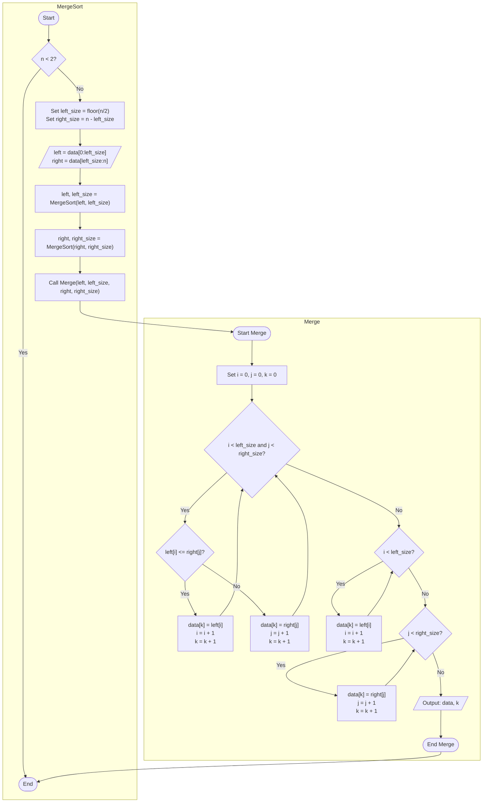

# MergeSort Algorithm

```mermaid
flowchart TB
  %% –––––––––– MergeSort Main –––––––––– %%
  subgraph "MergeSort"
    MSStart([Start])
    MSCheck{"n < 2?"}
    MSEnd([End])
    MSSize["Set left_size = floor(n/2)
    Set right_size = n - left_size"]
    MSSplit[/"left = data[0:left_size]
    right = data[left_size:n]"/]
    MSRecL["left, left_size = MergeSort(left, left_size)"]
    MSRecR["right, right_size = MergeSort(right, right_size)"]
    MSCallM["Call Merge(left, left_size, right, right_size)"]
    MSStart --> MSCheck
    MSCheck -- Yes --> MSEnd
    MSCheck -- No --> MSSize --> MSSplit --> MSRecL --> MSRecR --> MSCallM
  end


  %% –––––––––– Merge Subroutine –––––––––– %%
  subgraph "Merge"
    MStart([Start Merge])
    MInit["Set i = 0, j = 0, k = 0"]
    MLoop{"i < left_size and j < right_size?"}
    MComp{"left[i] <= right[j]?"}
    MUseL["data[k] = left[i]
    i = i + 1
    k = k + 1"]
    MUseR["data[k] = right[j]
    j = j + 1
    k = k + 1"]
    MRemL{"i < left_size?"}
    MCopyL["data[k] = left[i]
    i = i + 1
    k = k + 1"]
    MRemR{"j < right_size?"}
    MCopyR["data[k] = right[j]
    j = j + 1
    k = k + 1"]
    MSOutput[/"Output: data, k"/]
    MEnd([End Merge])
    MStart --> MInit --> MLoop
    MLoop -- Yes --> MComp
    MComp -- Yes --> MUseL --> MLoop
    MComp -- No  --> MUseR --> MLoop
    MLoop -- No  --> MRemL
    MRemL -- Yes --> MCopyL --> MRemL
    MRemL -- No  --> MRemR
    MRemR -- Yes --> MCopyR --> MRemR
    MRemR -- No  --> MSOutput --> MEnd
  end

  %% –––– Cross-module connections –––– %%
  MSCallM --> MStart
  MEnd    --> MSEnd
```
